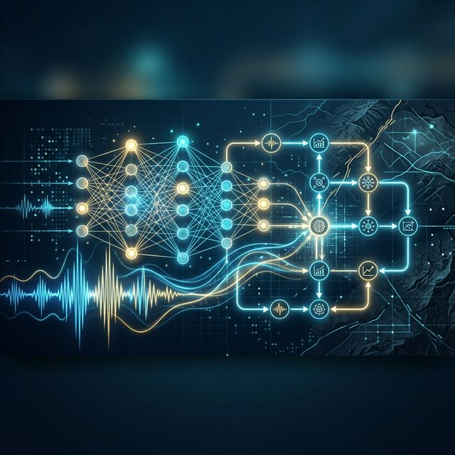

# Hi, I'm Birrul Walidain 👋

  

### 🔬 Seismology AI & Autonomous Systems | Computational Physicist | LIBS Specialist

I am a physicist and developer focused on the intersection of **Seismology** and **Autonomous AI**. 
My work revolves around building agentic ecosystems for automated earthquake detection, picking, and seismic signal processing.

- 🔭 **SeisAgent-OS**: Developing an autonomous operating system for seismic monitoring and agentic decision making.
- 🔬 **LIBS Spectroscopy**: Researching elemental analysis and optical signal processing using Voigt profile fitting.
- 🖥️ **HPC & Data**: Scaling scientific simulations and data pipelines on Linux Clusters.

---

### 🛠️ Tech Stack & Science Toolkit
| Category | Tools & Languages |
| :--- | :--- |
| **Seismology & AI** |    |
| **Data Science** |     |
| **Engineering** |    |
| **Workflow** |   |

---

### 📈 GitHub Stats

  
  

---

### 📝 Notable Projects
- **SeisAgent-OS**: An autonomous AI-driven OS for seismological data interpretation.
- **analisis_gempa**: Advanced earthquake analysis tools and ML models.
- **Tele-Alpha-Radar**: Remote sensing and signal radar processing.

---

### 🐍 Contribution Snake

---

  © 2026 Birrul Walidain | Building the future of Autonomous Science 🌍

