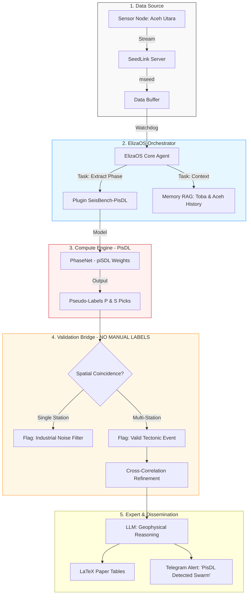

# Hi, I'm raden muhammad yudie sanjaya 👋

### 🔬 Seismology AI & Autonomous Systems | Computational Physicist | LIBS Specialist

I am a physicist and developer focused on the intersection of **Seismology** and **Autonomous AI**. 
My work revolves around building agentic ecosystems for automated earthquake detection, picking, and seismic signal processing in high-noise industrial environments.

---

## ⚡ Current Main Project: SeisAgent-PisDL
**Autonomous Earthquake Detection System for Noisy Environments (Aceh Utara & Lhokseumawe Case)**

Since the study area is located near industrial zones with high cultural noise and lacks high-quality manual picking (Label Scarcity), I've developed a **Self-Supervised / Transfer Learning** framework using **PisDL (Physics-Informed Deep Learning)**.

### 🏗️ Modified System Architecture

### 🛠️ Key Research Strategies
- **Cross-Station Coincidence**: Filtering industrial noise by correlating signal arrival times across the network.
- **PisDL as Synthetic Expert**: Generating high-confidence **Pseudo-Labels** (> 0.95) for model adaptive fine-tuning.
- **Nightly Baseline Calibration**: Automated signal baseline acquisition during midnight (00:00-04:00 WIB) to obtain the cleanest environment signature.

---

### 🧰 Tech Stack
| Domain | Tools & Languages |
| :--- | :--- |
| **Seismology & AI** |    |
| **Autonomous Agent**|   |
| **Engineering** |    |

---

  © 2026 raden muhammad yudie sanjaya | Building the Intelligence of Earth 🌍

